# 🧠 Multi-Agent System – Technical Solution Documentation

Welcome to the technical documentation for the multi-agent system implemented with the `pydantic-ai` framework. This document provides a structured overview of the system architecture, involved agents, used tools, and potential improvements. The solution focuses on intelligent orchestration, robust data handling, and extendability for business-critical use cases.

---

## ⚙️ System Components

### 🛠️ Tools

The following tools are implemented within the multi-agent system and are used by the agents to fulfill their tasks:

- `create_transaction`: Creates a new transaction (e.g. sale or inventory order) in the database. It stores item name, type, quantity, price, and date, and returns the transaction ID.
- `get_all_inventory`: Returns the current inventory of all items as a dictionary. It considers all purchases and sales up to a specified date.
- `get_stock_level`: Determines the current stock level of a specific item at a given date and returns it as a DataFrame.
- `get_supplier_delivery_date`: Calculates the estimated delivery date for a supplier order based on quantity and start date.
- `get_cash_balance`: Calculates the current cash balance by offsetting revenues from sales and expenses for inventory purchases up to a specific date.
- `generate_financial_report`: Generates a comprehensive financial report as of the specified date, including cash balance, inventory value, total assets, inventory overview, and the top five revenue-generating products.
- `search_quote_history`: Searches the quote history for specific terms and returns matching offers with relevant details.

---

## 🤖 Agents

### 🧩 Orchestrator Agent

The Orchestrator Agent is the central brain of the multi-agent system. It receives customer requests, analyzes them, and classifies them as either **INQUIRY** or **ORDER**. Based on the classification, it routes the request to the appropriate agents and coordinates the processing along the entire chain.

### 📦 Inventory Agent

Responsible for checking stock availability. For **INQUIRIES**, it provides details about stock levels and potential delivery dates. For **ORDERS**, it checks inventory and triggers an automatic reorder if necessary to fulfill the order.

**Tools used:**
- `get_stock_level`
- `get_supplier_delivery_date`
- `create_transaction` (for reorders)

### 💬 Quote Agent

The Quote Agent creates competitive offers based on the customer's request and inventory data. It considers historical quotes, pricing models, and potential volume discounts.

**Tools used:**
- `search_quote_history`
- `generate_financial_report` (for analyzing quote data)

### 🧾 Sales Finalization Agent

Handles final order processing. It re-checks inventory, calculates expected delivery dates, and records the sale as a transaction in the database.

**Tools used:**
- `get_stock_level`
- `get_supplier_delivery_date`
- `create_transaction` (for sales)

### 🧮 Invoice Agent

Generates a structured invoice in plain-text format. It inserts `<placeholder>` values for any missing customer information and explicitly lists granted discounts. The invoice is based on data from the Quote and Sales processes.

---

## 🔄 Workflow Diagram

The workflow diagram illustrates the interactions between agents and their tools. It shows how customer requests are processed, which data is required, and how agents collaborate.

### 💡 Process Overview:

- The **Orchestrator Agent** receives a customer request and classifies it as either **INQUIRY** or **ORDER**.
- For an **INQUIRY**, the **Inventory Agent** is triggered to fetch stock levels and estimated delivery dates.
- For an **ORDER**, the **Inventory Agent**:
    - Checks stock and triggers a reorder if necessary.
    - Passes the process to the **Quote Agent**.
- The **Quote Agent** prepares a tailored offer considering past offers and pricing strategies.
- The **Sales Finalization Agent**:
    - Re-validates inventory,
    - Records the sale transaction,
    - Estimates delivery time.
- Finally, the **Invoice Agent**:
    - Creates a detailed invoice,
    - Replaces missing customer details with `<placeholder>`,
    - Clearly states applied discounts.

### 🧠 Agent Roles

| Role            | Description                                                              |
|-----------------|--------------------------------------------------------------------------|
| **ORCHESTRATOR**| Central control and classification (INQUIRY or ORDER)                    |
| **INVENTORY**   | Stock check, delivery estimation, reorder handling                       |
| **QUOTE**       | Offer generation with history and discount logic                         |
| **SALES**       | Finalization, transaction recording, and delivery date calculation       |
| **INVOICE**     | Invoice creation in plain-text format                                    |

---

## 🧰 Technology Stack

The system is implemented in Python using the `pydantic-ai` framework. SQLite is used for storing inventory and transactions. Agents communicate via defined interfaces and rely on shared tools to perform their tasks.

### 🚀 Why `pydantic-ai`?

The following benefits made `pydantic-ai` the framework of choice:

- **Strict Typing & Data Validation**  
  Ensures high data reliability—crucial in business-critical systems dealing with structured data like inventory and transactions.

- **Declarative Agent Definitions**  
  Clear input/output models improve traceability and reduce orchestration complexity.

- **Clean Orchestration**  
  The Orchestrator addresses agents through well-defined Pydantic models—no external planning components required.

- **Rapid Prototyping**  
  Enables quick development and isolated agent testing—ideal for time-boxed projects (6 hours).

- **Debug-Friendly**  
  Explicit in/out structures make processes transparent and easy to verify.

**Conclusion:**  
`pydantic-ai` combines clarity, reliability, and simplicity—ideal for agent-driven systems with defined responsibilities and secure data flows.

---

## 🚀 Suggestions for Improvement

- **Context Management**  
  Introduce a context manager to track request status and agent communication to improve traceability and efficiency.

- **Customer Agent**  
  A dedicated agent for interacting with the customer could enable personalized negotiation and engagement.

- **Terminal Animation**  
  A visual animation showing the request flow through the agents would enhance user-friendliness and understanding.

- **Business Advisor Agent**  
  Analyzes transactions and provides efficiency suggestions for optimizing business operations.

- **Real-Time Data Integration**  
  Connect external data sources (e.g., market prices, supplier times) to improve decision quality.

- **Extended Reporting**  
  Add reports that highlight customer trends and seasonal demand shifts to support strategic decisions.

- **Enhanced Error Handling**  
  Implement more robust mechanisms for detecting and managing errors to ensure system stability.

---
